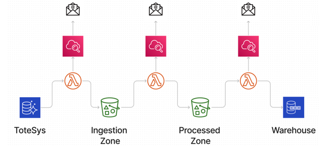

#  AWS_ELT_Pipeline
## The Product

A data platform that extracts data from an operational database archives it in a data lake, and makes it available in a remodelled OLAP data warehouse. The application will:
  - operate automatically on a schedule
  - log progress to Cloudwatch
  - trigger email alerts in the event of failures

 

## Technical Details

1. The platform will consist of three AWS lambdas, orchastrated by step functions.
1. The total run time of the state machine is ~2 minutes
1. An AWS event bridge will schedule the state machine to run every 20 minutes to ensure that any data in the OLAP database is loaded into the data warehouse within 30 minutes of being added.
1. Lambda 1 will load data into an S3 bucket that will act as a "landing zone" for ingested data.
1. A Python application to check for changes to the database tables and ingest any new or updated data. 
1. Status and error messages should be logged to Cloudwatch.
1. A Cloudwatch alert should be generated in the event of a major error - this should be sent to email.
1. A Python application to transform data landing in the "ingestion" S3 bucket and place the results in the "processed" S3 bucket. The data should be transformed to conform to the warehouse schema (see below). 
1. A Python application that will periodically schedule an update of the data warehouse from the data in S3. Again, status and errors should be logged to Cloudwatch, and an alert triggered if a serious error occurs.

## The Data

The platform is designed to load data from the following database: https://dbdiagram.io/d/SampleDB-6332fecf7b3d2034ffcaaa92 

The reformatted [star schema](https://dbdiagram.io/d/637a423fc9abfc611173f637) will contain the following:
|tablename|
|---------|
|fact_sales_order|
|dim_staff|
|dim_location|
|dim_design|
|dim_date|
|dim_currency|

### History
Your warehouse will contain a full history of all updates to _facts_. For example, if a sales order is 
created in `totesys` and then later updated (perhaps the `units_sold` field is changed), you should have _two_ 
records in the `fact_sales_order` table.

## Requirements

- Python Version 3.11.1
- An AWS account
- A SafetyCLI account and access key

## Instructions for Use
1. Add and populate the following GitHub secrets:

|Secrets| Description|
|-------|------------|
|PG_USER|Postgres username|
|PG_PASSWORD|Postgres password for OLTP database|
|PG_DATABASE|Name of Postgres OLTP database|
|PG_HOST|OLTP datebase host|
|PG_PORT|Datbase port|
|PG_PASSWORD_DW|Postgres password for OLAP database|
|PG_DATABASE_DW|Name of Postgres OLAP database|
|PG_HOST_DW|OLAP datebase host|
|AWS_ACCESS_KEY_ID| AWS access key|
|AWS_SECRET_ACCESS_KEY| AWS secret access key|
|AWS_REGION| AWS region|
|SNS_EMAIL| Recipient address of Cloudwatch emails|

2. create an AWS S3 bucket to store the terraform state

3. In the main.tf file amend the feild Terraform>backend>bucket to specify your newly created bucket

4. Ensure your branch is listed on the YAML in the on>push>branches section

5. Push to GitHub

6. If all tests pass and requirments are satisfied, the code will be deployed in your AWS account.